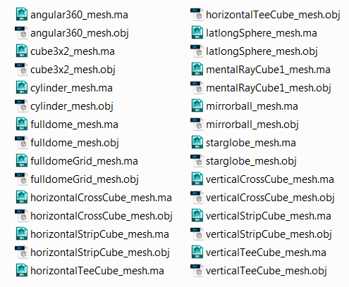

# Panoramic Geometry Collection #
**Version 1** Released Dec 7, 2013  
by Andrew Hazelden

## Overview ##

This is a collection of panoramic meshes that can be used to preview equirectangular, mirrorball, fulldome, cylindrical, and cubic panoramas. The meshes were created as part of the development process for the Domemaster3D shader's [DomeViewer Tool](https://code.google.com/p/domemaster-stereo-shader/wiki/DomeViewer).

If you need a tool to convert imagery between the different cubic formats you should try out my [Domemaster Photoshop Actions Pack](http://www.andrewhazelden.com/blog/2012/11/domemaster-photoshop-actions-pack/).

The panoramic mesh files are released under a GPL v3 license and are available in Maya and OBJ formats:

## Available Meshes ##
The following files are included:
> - angular360_mesh.ma
> - angular360_mesh.obj
> - cube3x2_mesh.ma
> - cube3x2_mesh.obj
> - cylinder_mesh.ma
> - cylinder_mesh.obj
> - fulldomeGrid_mesh.ma
> - fulldomeGrid_mesh.obj
> - fulldome_mesh.ma
> - fulldome_mesh.obj
> - horizontalCrossCube_mesh.ma
> - horizontalCrossCube_mesh.obj
> - horizontalStripCube_mesh.ma
> - horizontalStripCube_mesh.obj
> - horizontalTeeCube_mesh.ma
> - horizontalTeeCube_mesh.obj
> - latlongSphere_mesh.ma
> - latlongSphere_mesh.obj
> - mentalRayCube1_mesh.ma
> - mentalRayCube1_mesh.obj
> - mirrorball_mesh.ma
> - mirrorball_mesh.obj
> - starglobe_mesh.ma
> - starglobe_mesh.obj
> - verticalCrossCube_mesh.ma
> - verticalCrossCube_mesh.obj
> - verticalStripCube_mesh.ma
> - verticalStripCube_mesh.obj
> - verticalTeeCube_mesh.ma
> - verticalTeeCube_mesh.obj                        

## Closing Notes ##

I hope you find these mesh files useful for your VR/Pano/Fulldome projects. If you have any questions, feel free to contact me via email or twitter. 

Cheers,  
Andrew Hazelden

Email: [andrew@andrewhazelden.com](mailto:andrew@andrewhazelden.com)   
Blog: [http://www.andrewhazelden.com](http://www.andrewhazelden.com)  
Twitter: [@andrewhazelden](https://twitter.com/andrewhazelden)  
Google+: [https://plus.google.com/+AndrewHazelden](https://plus.google.com/+AndrewHazelden)
