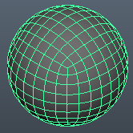

# Panoramic Geometry Collection #
**Version 2** Released 2015-02-23
by Andrew Hazelden

## Overview ##

This is a collection of panoramic meshes that can be used to preview equirectangular, mirrorball, fulldome, cylindrical, and cubic panoramas. The meshes were created as part of the development process for the Domemaster3D shader's [DomeViewer Tool](https://code.google.com/p/domemaster-stereo-shader/wiki/DomeViewer).

If you need a tool to convert imagery between the different cubic formats you should try out my [Domemaster Photoshop Actions Pack](http://www.andrewhazelden.com/blog/2012/11/domemaster-photoshop-actions-pack/).

The panoramic mesh files are released under a GPL v3 license and are available in Maya and OBJ formats:

## Available Meshes ##
The following files are included:
> - angular360_mesh.ma
> - angular360_mesh.obj
> - cube3x2_mesh.ma
> - cube3x2_mesh.obj
> - cylinder_mesh.ma
> - cylinder_mesh.obj
> - fulldomeGrid_mesh.ma
> - fulldomeGrid_mesh.obj
> - fulldome_mesh.ma
> - fulldome_mesh.obj
> - horizontalCrossCube_mesh.ma
> - horizontalCrossCube_mesh.obj
> - horizontalStripCube_mesh.ma
> - horizontalStripCube_mesh.obj
> - horizontalTeeCube_mesh.ma
> - horizontalTeeCube_mesh.obj
> - latlongSphere_mesh.ma
> - latlongSphere_mesh.obj
> - mentalRayCube1_mesh.ma
> - mentalRayCube1_mesh.obj
> - mirrorball_mesh.ma
> - mirrorball_mesh.obj
> - starglobe_mesh.ma
> - starglobe_mesh.obj
> - verticalCrossCube_mesh.ma
> - verticalCrossCube_mesh.obj
> - verticalStripCube_mesh.ma
> - verticalStripCube_mesh.obj
> - verticalTeeCube_mesh.ma
> - verticalTeeCube_mesh.obj                        

## Image Projections ##

**Angular Fisheye 360 Degree**  

This image projection shows a fullframe 360° fisheye image that is also known as an HDRI lightprobe.

----------

**Cubemap 3x2**  

The Cubemap 3x2 faces are located in the format:
<table>
  <tr>
    <td>front</td> <td>right</td> <td>back</td>
  </tr>
  <tr>
    <td>left</td> <td>top</td> <td>bottom</td>
  </tr>
</table>

----------

**Cylinder**  

This image projection shows a cylindrically formatted image.

----------

**Fulldome Angular Fisheye 180 Degree**  

This image projection shows a fullframe 180° fisheye image that is also known as a domemaster image.

----------

**Horizontal Cross Cubemap**  

The horizontal cross faces are located in the format:

<table>
  <tr>
    <td>blank</td> <td>top</td> <td>blank</td> <td>blank</td>
  </tr>
  <tr>
    <td>left</td> <td>front</td> <td>right</td> <td>back</td>
  </tr>
  <tr>
    <td>blank</td> <td>bottom</td> <td>blank</td> <td>blank</td>
  </tr>
</table>

----------

**Horizontal Strip Cubemap**  

The horizontal strip faces are located in the format:

<table>
  <tr>
    <td>front</td> <td>right</td> <td>back</td> <td>left</td> <td>top</td> <td>bottom</td>
  </tr>
</table>

----------

**Horizontal Tee Cubemap**  

The horizontal tee faces are located in the format:

<table>
  <tr>
     <td>top</td> <td>blank</td> <td>blank</td> <td>blank</td>
  </tr>
  <tr>
    <td>front</td> <td>right</td> <td>back</td> <td>left</td>
  </tr>
  <tr>
    <td>bottom</td> <td>blank</td> <td>blank</td> <td>blank</td> 
  </tr>
</table>

----------

**Equirectangular, Latitude/Longitude,  Spherical**  

This image projection shows a 2:1 aspect ratio 360° x 180° spherical panorama.

----------

**Mental Ray Cube 1**  

The image projection shows a the mental ray `mib_lookup_cube1` horizontal strip image format.

The faces are located in the format:

<table>
  <tr>
    <td>left</td>
  </tr>
  <tr>
    <td>right</td>
  </tr>
  <tr>
    <td>bottom</td>
  </tr>
  <tr>
    <td>top (flipped vertically)</td>
  </tr>
  <tr>
    <td>back</td>
  </tr>
  <tr>
    <td>front</td>
  </tr>
</table>

----------

**Mirrorball**  

A mirrorball or ball map image is what you get when you photograph a chrome sphere. This image projection is common in the visual effects industry when a quick set lighting reference and environment map is needed.

----------

**Starglobe / Quadsphere**  

The Starglobe / quadsphere format is a custom polygon sphere that avoids the issues of pinched polar regions by using an all quad polygon topology. This is the same type of geometry that is used as the Mudbox primitive sphere shape.

----------
**Vertical Cross Cubemap**  

The vertical cross faces are located in the format:

<table>
  <tr>
    <td>blank</td> <td>top</td> <td>blank</td>
  </tr>
  <tr>
    <td>left</td> <td>front</td> <td>right</td>
  </tr>
  <tr>
    <td>blank</td> <td>bottom</td> <td>blank</td>
  </tr>
  <tr>
    <td>blank</td> <td>back (rotated 180&deg;)</td> <td>blank</td>
  </tr>
</table>

----------
**Vertical Strip Cubemap**  

The vertical strip faces are located in the format:

<table>
  <tr>
    <td>front</td>
  </tr>
  <tr>
    <td>right</td>
  </tr>
  <tr>
    <td>back</td>
  </tr>
  <tr>
    <td>left</td>
  </tr>
  <tr>
    <td>top</td>
  </tr>
  <tr>
    <td>bottom</td>
  </tr>
</table>

----------
**Vertical Tee Cubemap**  

The vertical tee faces are located in the format:

<table>
  <tr>
    <td>left</td> <td>front</td> <td>right</td>
  </tr>
  <tr>
     <td>blank</td> <td>bottom</td><td>blank</td>
  </tr>
  <tr>
     <td>blank</td> <td>back (rotated 180&deg;)</td> <td>blank</td> 
  </tr>
  <tr>
     <td>blank</td> <td>top</td> <td>blank</td>
  </tr>
</table>
----------

## Closing Notes ##

I hope you find these mesh files useful for your VR/Pano/Fulldome projects. If you have any questions, feel free to contact me via email or twitter. 

Cheers,  
Andrew Hazelden

Email: [andrew@andrewhazelden.com](mailto:andrew@andrewhazelden.com)   
Blog: [http://www.andrewhazelden.com](http://www.andrewhazelden.com)  
Twitter: [@andrewhazelden](https://twitter.com/andrewhazelden)  
Google+: [https://plus.google.com/+AndrewHazelden](https://plus.google.com/+AndrewHazelden)
